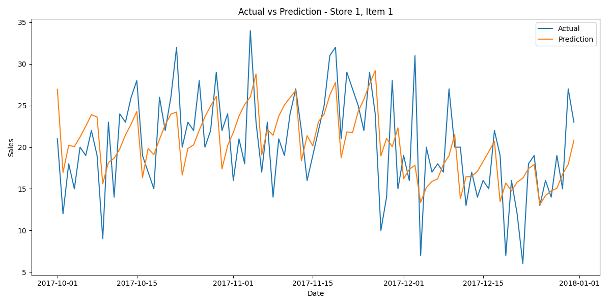
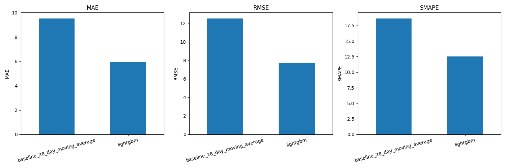

# CPG Demand Forecasting Platform

An end-to-end demand forecasting project inspired by real-world retail and consumer packaged goods (CPG) data science use cases.

The project forecasts daily product demand at **store-item level**, benchmarks a machine learning model against a classical forecasting baseline, and provides an interactive dashboard for business-facing analysis.

---

# Executive Summary

Demand forecasting is a core capability in retail and CPG environments, supporting:

- inventory planning
- replenishment decisions
- demand planning
- sales forecasting
- operational efficiency

This project simulates a realistic forecasting workflow by:

- building a modular ML forecasting pipeline
- engineering time-series features
- comparing baseline vs ML performance
- validating predictions using time-based splits
- producing recursive future forecasts
- exposing results through an interactive Streamlit dashboard

The solution uses **LightGBM regression** and demonstrates how machine learning can materially outperform simple forecasting heuristics.

---

# Business Problem

Retail businesses need accurate demand forecasts to answer questions such as:

> How much product demand should we expect next week or next month?

Poor forecasts can lead to:

- overstocking
- stockouts
- inefficient logistics
- missed sales opportunities
- poor planning decisions

The objective of this project is to predict future sales at **daily store-item level** using historical sales patterns.

---

# Dataset

Dataset:

**Store Item Demand Forecasting Challenge**

The dataset contains historical daily sales data for:

- **10 stores**
- **50 products**
- **5 years of history**

Core fields:

```text
date
store
item
sales
```

The project uses historical demand patterns to forecast future sales.

---

# Solution Overview

The forecasting pipeline includes:

### Data Pipeline

- loading historical sales data
- preprocessing time-series information
- feature engineering
- train-validation split

### Forecasting Approaches

Two approaches are compared:

1. **28-Day Moving Average Baseline**
2. **LightGBM Machine Learning Model**

### Model Evaluation

The model is evaluated using:

- MAE (Mean Absolute Error)
- RMSE (Root Mean Squared Error)
- SMAPE (Symmetric Mean Absolute Percentage Error)

### Product Layer

An interactive Streamlit dashboard allows users to:

- select store
- select item
- compare actual vs predicted demand
- review model performance
- inspect forecasting behaviour

---

# Project Architecture

```text
cpg-demand-forecasting-platform/
│
├── data/
│   ├── raw/
│   ├── processed/
│   └── predictions/
│
├── dashboard/
│   └── app.py
│
├── models/
│
├── reports/
│   └── figures/
│
├── src/
│   ├── baseline.py
│   ├── config.py
│   ├── evaluate.py
│   ├── features.py
│   ├── load_data.py
│   ├── model_comparison.py
│   ├── predict.py
│   ├── train.py
│   └── visualize.py
│
├── tests/
│
├── Dockerfile
├── docker-compose.yml
├── requirements.txt
└── run_pipeline.py
```

---

# Methodology

## Time-Based Validation

A time-based validation split is used.

Training period:

```text
Before 2017-10-01
```

Validation period:

```text
From 2017-10-01 onward
```

This reflects a realistic forecasting setup and avoids data leakage.

Unlike random train-test splits, forecasting systems must always predict future observations using past information only.

---

## Feature Engineering

The model uses several forecasting-oriented features.

### Calendar Features

```text
day of week
month
year
day of year
week of year
weekend flag
```

These features help capture:

- seasonality
- weekly demand behaviour
- yearly patterns

### Lag Features

```text
sales_lag_7
sales_lag_14
sales_lag_28
```

Lag features represent historical demand.

Example:

> What were sales 7 or 28 days ago?

These are highly informative in retail forecasting.

### Rolling Features

```text
rolling_mean_7
rolling_mean_28
```

Rolling windows smooth short-term volatility and help the model learn recent demand trends.

---

# Recursive Forecasting

The project implements **recursive forecasting**.

Instead of predicting all future periods at once, predictions are generated sequentially.

Simplified logic:

```text
Predict day t+1
↓
Use prediction as historical input
↓
Predict day t+2
↓
Repeat
```

In practice:

1. The model predicts tomorrow.
2. Tomorrow's prediction becomes part of historical data.
3. The next day prediction uses this updated history.

This better reflects real-world forecasting workflows.

---

# Models

## 1. Baseline Forecast

A **28-day moving average** is used as a baseline.

Logic:

> Predict future demand using the average demand from the previous 28 days.

This provides a simple but realistic benchmark.

---

## 2. LightGBM Forecasting Model

The primary model uses:

```text
LightGBM Regressor
```

Why LightGBM?

- fast training
- strong performance on tabular data
- robust handling of nonlinear patterns
- widely used in practical machine learning workflows

---

# Results

## Model Comparison

| Model | MAE | RMSE | SMAPE |
|---|---:|---:|---:|
| 28-Day Moving Average Baseline | 9.54 | 12.56 | 18.65% |
| LightGBM | 5.95 | 7.70 | 12.53% |

### Key Result

The LightGBM model materially outperformed the classical forecasting baseline.

Approximate improvement:

- **MAE:** ~38%
- **RMSE:** ~39%
- **SMAPE:** ~33%

This indicates that machine learning captured meaningful demand patterns beyond a simple moving average approach.

---

# Forecast Interpretation

The model successfully learns:

- overall demand trend
- seasonality
- short-term sales dynamics

Observed limitation:

The model smooths sudden spikes and dips.

This is expected because the current version does not yet include business-side explanatory features such as:

- promotions
- holidays
- pricing
- stock availability
- marketing activity

These would likely improve forecast quality.

---

# Visualizations

## Actual vs Prediction

Example:

```text
reports/figures/actual_vs_prediction_store_1_item_1.png
```



---

## Model Comparison

Example:

```text
reports/figures/model_comparison.png
```



---

# Streamlit Dashboard

The project includes an interactive dashboard.

Features:

- store selection
- item selection
- actual vs predicted demand visualization
- model performance metrics
- model comparison view

Run locally:

```bash
streamlit run dashboard/app.py
```

---

# Running the Project

## 1. Install Dependencies

```bash
pip install -r requirements.txt
```

---

## 2. Train Model and Generate Forecasts

```bash
python run_pipeline.py
```

Outputs:

```text
models/lightgbm_demand_model.joblib
reports/metrics.json
reports/figures/model_comparison.png
reports/figures/actual_vs_prediction_store_1_item_1.png
data/predictions/submission.csv
data/predictions/recursive_predictions_detailed.csv
```

---

## 3. Run Dashboard

```bash
streamlit run dashboard/app.py
```

Open:

```text
http://localhost:8501
```

---

# Docker

Run pipeline:

```bash
docker compose up forecasting
```

Run dashboard:

```bash
docker compose up dashboard
```

Then open:

```text
http://localhost:8501
```

---

# Future Improvements

Potential next steps:

- holiday features
- promotion signals
- pricing effects
- stockout indicators
- hyperparameter tuning
- SHAP explainability
- backtesting across multiple periods
- Databricks deployment
- forecast monitoring and drift detection

---

# Key Takeaways

This project demonstrates:

- end-to-end forecasting pipeline design
- time-series feature engineering
- baseline benchmarking
- ML model evaluation
- recursive forecasting
- business-oriented dashboarding
- modular, production-minded project structure

The solution shows how machine learning can materially improve forecasting performance in a retail/CPG setting.